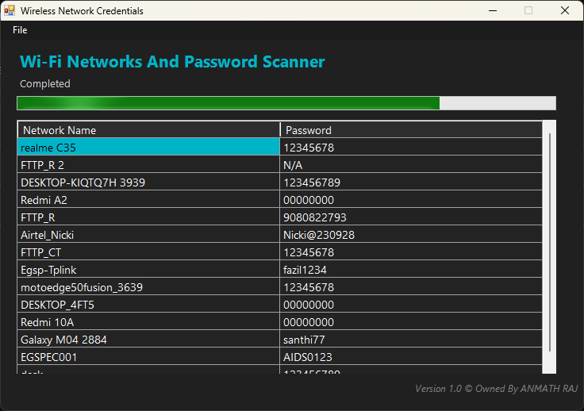

# WiFi-Network-Password-Scanner_WNPS
A professional Windows GUI application for viewing Wi-Fi network credentials using PowerShell and WinForms.

## About
**WNPS** is a clean, enterprise-style Windows application that displays all saved Wi-Fi SSIDs along with their stored passwords (where available).
The tool features a modern dark UI, progress tracking, file management, and is compiled into a standalone executable for ease of use.
## Features
- Displays saved Wi-Fi SSIDs and passwords
- Export credentials to CSV / TXT
- Standalone `.exe` build
- Administrator enforcement
- Clean, maintainable source code

## Screenshots
### Main Interface

## Requirements
- Windows 10 / 11
- PowerShell 5.1+
- Administrator

## Usage
### Run the Executable
Download exe from the **releases** folder: WNPS.exe

## License

MIT License – see the [LICENSE](LICENSE) file.

